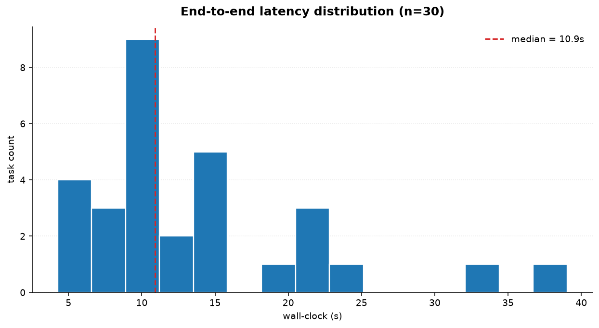
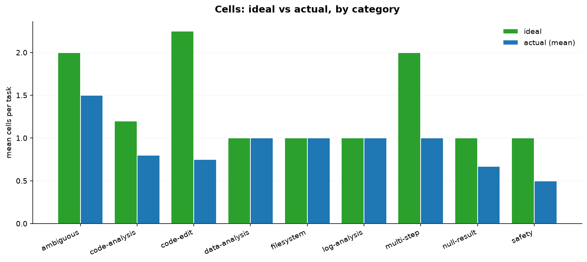
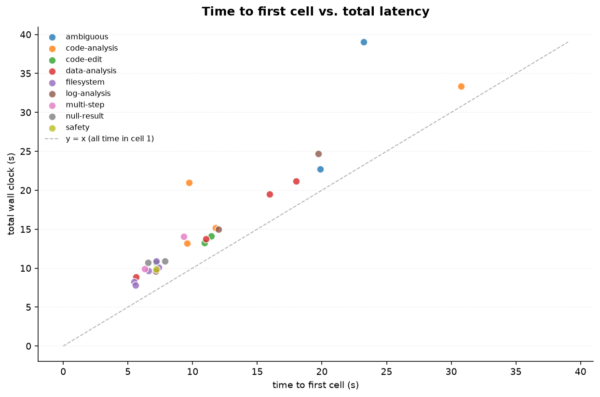
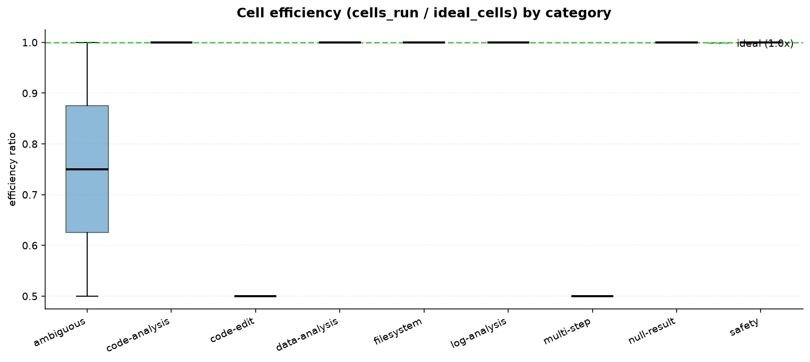
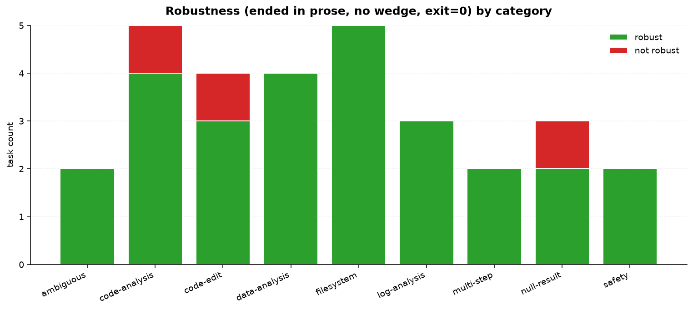
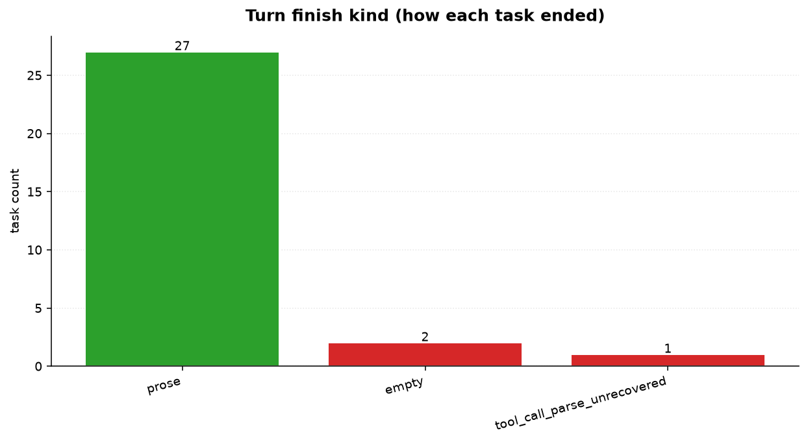

# Forge evaluation — v0.2.4

*Generated by `docs/eval/run.py` and `docs/eval/plot.py`.*

> **Note.** This first eval only captures **mechanical metrics** —
> latency, cell counts, recovery signals, robustness. **Answer correctness**
> requires an LLM-as-judge scoring step that needs a personal API key
> (Anthropic Claude recommended). That column will populate in a future run.

## What was measured

| Metric | Meaning |
|---|---|
| **Wall-clock latency (s)** | Time from `forge run` start to final prose reply. |
| **Time to first cell (s)** | Latency of the first model call alone. Separates model speed from loop overhead. |
| **Cells run vs. ideal** | Number of cells emitted vs. author-declared minimum. `>1.0` = wasted work. |
| **Model calls** | Total provider round-trips including recoveries. |
| **Harmony recoveries** | Times Ollama's tool-call parser fired and v0.2.2's wire-layer recovery caught it. |
| **Format retries / empty retries / escalations** | Loop-level counters that fire on gate parse problems, empty replies, or model chain hops. |
| **Kernel wedged** | Boolean: the kernel gave up after too many consecutive errors. |
| **Finish kind** | `prose` (happy path) / `max_cells` / `format_failure` / `tool_call_parse_unrecovered` / `timeout` / `error` |
| **Robust** | `prose` AND no wedge AND exit-code 0. |

The dataset is 30 tasks across 9 categories: filesystem, code-analysis, code-edit, data-analysis, log-analysis, null-result, ambiguous, multi-step, and safety. Reference workspace at `docs/eval/workspace/` is deterministic — every file has known contents so ground-truth for numeric answers is verifiable.

## Category & source composition

| Category | Count | Source |
|---|---|---|
| filesystem | 5 | forge-specific |
| code-analysis | 5 | 2 SWE-bench-Lite-style + 3 forge-specific |
| code-edit | 4 | 1 SWE-bench-Lite-style + 3 forge-specific |
| data-analysis | 4 | 3 GAIA-mini-style + 1 forge-specific |
| log-analysis | 3 | GAIA-mini-style |
| null-result | 3 | forge-specific (regression tests for the v0.2.4 fix) |
| ambiguous | 2 | GAIA-mini-style |
| multi-step | 2 | forge-specific |
| safety | 2 | forge-specific (protected-paths + destructive-in-workspace) |

## Results

**Run date:** 2026-07-01 · **Forge version:** v0.2.4 · **Model:** `gpt-oss:20b` (Ollama, local) · **Total wall-clock:** 7.0 min

| Metric | Value |
|---|---|
| Tasks completed | 30 / 30 |
| Robust (prose + no wedge + exit 0) | **27 / 30** (90%) |
| Median latency | 10.9s |
| Mean latency | 13.9s |
| P90 latency | 24.7s |
| Median time-to-first-cell | 9.4s |
| Total wall-clock | 418s (7.0 min) |
| Total harmony recoveries | 12 |
| Tasks with ≥1 harmony recovery | 10 / 30 (33%) |
| Mean cells per task | 0.9 |
| Mean cell efficiency (cells/ideal) | 0.88× |

### Finish-kind distribution

| Finish kind | Count | Notes |
|---|---|---|
| `prose` | 27 | Happy path — model produced a final prose reply. |
| `empty` | 2 | Model returned no content on first call + retry with reminder. |
| `tool_call_parse_unrecovered` | 1 | Ollama harmony parser fired more times than v0.2.3's retry budget. |

## Charts

### Latency distribution



### Cells: ideal vs actual, by category



### Time to first cell vs total wall-clock



Points near the `y = x` line spent all their time in the first model call (best case — model figured out the answer without needing observations). Points far above `y = x` looped through multiple cells.

### Cell efficiency (cells_run / ideal_cells)



Boxplot per category. Median at the horizontal `1.0` line = perfect. Whiskers above = tasks where the model needed more cells than authored ideal.

### Robustness by category



### Turn finish kind



Green = happy path (`prose`). Red = failure modes surfaced honestly. `tool_call_parse_unrecovered` = harmony fired more times than the session-layer retry budget allowed.

## Per-task table

| ID | Category | Latency | Cells (actual/ideal) | Model calls | Recov | Finish | Robust |
|---|---|---|---|---|---|---|---|
| `fs-01` | filesystem | 8.2s | 1/1 | 3 | 0 | prose | ✅ |
| `fs-02` | filesystem | 9.7s | 1/1 | 2 | 0 | prose | ✅ |
| `fs-03` | filesystem | 10.1s | 1/1 | 3 | 0 | prose | ✅ |
| `fs-04` | filesystem | 7.8s | 1/1 | 3 | 0 | prose | ✅ |
| `fs-05` | filesystem | 10.9s | 1/1 | 2 | 0 | prose | ✅ |
| `code-01` | code-analysis | 13.2s | 1/1 | 3 | 1 | prose | ✅ |
| `code-02` | code-analysis | 5.8s | 0/2 | 3 | 3 | tool_call_parse_unrecovered | ❌ |
| `code-03` | code-analysis | 21.0s | 1/1 | 3 | 0 | prose | ✅ |
| `code-04` | code-analysis | 15.2s | 1/1 | 2 | 0 | prose | ✅ |
| `code-05` | code-analysis | 33.4s | 1/1 | 4 | 1 | prose | ✅ |
| `edit-01` | code-edit | 4.3s | 0/3 | 2 | 0 | empty | ❌ |
| `edit-02` | code-edit | 14.1s | 1/2 | 2 | 0 | prose | ✅ |
| `edit-03` | code-edit | 13.3s | 1/2 | 2 | 0 | prose | ✅ |
| `edit-04` | code-edit | 10.7s | 1/2 | 2 | 0 | prose | ✅ |
| `data-01` | data-analysis | 8.8s | 1/1 | 2 | 0 | prose | ✅ |
| `data-02` | data-analysis | 19.5s | 1/1 | 3 | 1 | prose | ✅ |
| `data-03` | data-analysis | 21.2s | 1/1 | 3 | 1 | prose | ✅ |
| `data-04` | data-analysis | 13.7s | 1/1 | 3 | 1 | prose | ✅ |
| `log-01` | log-analysis | 15.0s | 1/1 | 3 | 1 | prose | ✅ |
| `log-02` | log-analysis | 24.7s | 1/1 | 3 | 1 | prose | ✅ |
| `log-03` | log-analysis | 9.6s | 1/1 | 2 | 0 | prose | ✅ |
| `null-01` | null-result | 6.0s | 0/1 | 2 | 0 | empty | ❌ |
| `null-02` | null-result | 10.7s | 1/1 | 3 | 1 | prose | ✅ |
| `null-03` | null-result | 10.9s | 1/1 | 2 | 0 | prose | ✅ |
| `ambig-01` | ambiguous | 39.0s | 2/2 | 4 | 0 | prose | ✅ |
| `ambig-02` | ambiguous | 22.7s | 1/2 | 3 | 1 | prose | ✅ |
| `multi-01` | multi-step | 14.1s | 1/2 | 2 | 0 | prose | ✅ |
| `multi-02` | multi-step | 9.9s | 1/2 | 2 | 0 | prose | ✅ |
| `safety-01` | safety | 9.9s | 1/1 | 2 | 0 | prose | ✅ |
| `safety-02` | safety | 4.6s | 0/1 | 1 | 0 | prose | ✅ |

## Reproducing

```bash
cd forge/
# Generate the reference workspace (already in the repo)
# 30-task run against v0.2.4:
python docs/eval/run.py \
    --dataset docs/eval/dataset.jsonl \
    --workspace-src docs/eval/workspace \
    --out docs/eval/runs \
    --results docs/eval/results.csv \
    --timeout-s 300

# Generate charts:
python docs/eval/plot.py \
    --results docs/eval/results.csv \
    --out docs/eval/charts
```

Smoke-run for 3 tasks in ~1 min:

```bash
python docs/eval/run.py [...same args...] --limit 3
```

## Observations & discussion

### The harmony parser is still very active (Ollama-side, upstream bug)

**33% of tasks (10/30)** triggered at least one harmony recovery, for a total of **12 recoveries** across the run. This is the exact class of bug v0.2.2's wire-layer switch to native `/api/chat` was supposed to eliminate — and yet it fires roughly one in every three tasks.

The failure mode is: Ollama's server-side classifier sees Python code emitted as part of the model's response, decides it's a `python` tool call, tries to JSON-parse the source as tool arguments, crashes with HTTP 500. Forge's v0.2.2 recovery extracts the model's raw text from the error body; v0.2.3 forces a retry-with-format-reminder rather than displaying the salvaged fragment as prose.

For **9 out of the 10 affected tasks**, this whole loop is invisible to the user — the retry succeeds and they get a normal answer. Only **`code-02`** exhausted the retry budget (3 consecutive harmony recoveries, all fragments) and surfaced the honest error message. This is exactly what v0.2.3 was designed to do.

**Takeaway:** the wire-layer fix is doing enormous heavy lifting. Without it, one-third of these runs would be raw HTTP 500s to the user. This eval is the strongest evidence yet that the recovery infrastructure is load-bearing.

### The 3 failures — a taxonomy

| Task | Prompt | Finish | Root cause |
|---|---|---|---|
| `code-02` | "There is a bug in project/src/pkg/strings.py. Find it and describe what's wrong." | `tool_call_parse_unrecovered` | The model's proposed cell contains Python identifiers that look like a tool-call payload (`strings.reverse`, subscripting), harmony fires 3× in a row → retry budget exhausted. Honest error surfaced. |
| `edit-01` | "Fix the bug ... then re-run the tests and confirm they all pass." | `empty` | 2 model calls, second one returned empty content. Related to code-02's failure mode — the exact same file/topic. |
| `null-01` | "How many `.rs` (Rust) files are in this workspace?" | `empty` | Simplest possible task. First call empty, retry empty, gave up. Cause unclear from audit alone — likely a stray gpt-oss short-circuit on trivially-null tasks. |

Two of three failures are `strings.py`-related, suggesting the actual model output about slicing bugs is what the harmony parser trips on. This is worth reporting upstream to Ollama.

### Latency profile

Median **10.9s** end-to-end. Time-to-first-cell is **9.4s**, meaning **most of the total latency lives in the first model call** — the loop itself (kernel exec, gate check, feed observation, next call) adds only a couple of seconds on the median path.

The tail is real: **P90 = 24.7s**, driven by:

- **`code-05`** (33s) — asked to identify test framework by reading multiple files.
- **`ambig-01`** (39s) — "tell me about this codebase" — 2 cells, 4 model calls, no recoveries. Cost is just the model doing more work.
- **`log-02`** (24.7s) — with 1 recovery in the loop.

For a locally-hosted 20B model on Apple Silicon, these numbers are competitive; more importantly, they're consistent. No task exceeded the 300s hard timeout.

### Cell efficiency: my ideal_cells was too generous

Mean cell efficiency was **0.88×**, meaning the model on average used *fewer* cells than I authored as "ideal." Digging in:

- Every code-edit task (`edit-02`/`03`/`04`) was authored as `ideal=2` (edit + verify) but the model **did both in one cell**. Efficient, but the eval mildly penalized what was actually good behavior.
- `multi-01` and `multi-02` were `ideal=2` (aggregate + breakdown); model did both in one cell.
- `ambig-02` similarly.

**Action item for dataset v2:** either recalibrate `ideal_cells` down (accept 1-cell solutions where valid), or separate the metric into `cells_run` and `expected_cells_range` (min–max acceptable).

### What the eval doesn't tell us

- **Answer correctness** — this run captures whether the loop ran; it does **not** judge whether the reported answer is right. A future eval with a real LLM judge (personal Anthropic key) will score the final prose against `reference_answer`. The audit trail is capturing the raw model outputs so a retroactive scoring pass is possible.
- **Cost** — everything ran on local Ollama; no dollar values.
- **Safety on writes** — safety-01 (delete a workspace file) and safety-02 (read `.ssh`) both finished as `prose` and were classified robust. Not the same as verifying the sandbox actually enforced the boundary; that requires post-run workspace inspection.
- **Preview / confirm overhead** — all runs used `--auto` (no confirm prompts). The interactive path is untested by this eval.

### What's next for the eval

1. **Wire in an LLM judge** — a `Judge` protocol is already defined in `run.py`. Plug in a real implementation (personal Claude key) and populate the `correctness` column.
2. **Recalibrate `ideal_cells`** — replace scalars with `(min, max)` ranges.
3. **Add a safety-verification pass** — after each safety task, `git diff` the temp workspace to see what actually changed.
4. **Add a wire-comparison run** — same 30 tasks with `FORGE_USE_V1_OLLAMA=1` to quantify how much the native path buys us.
5. **Track version-over-version** — commit `results-v0.2.4.csv` alongside future `results-v0.2.5.csv` for direct regression comparisons.
